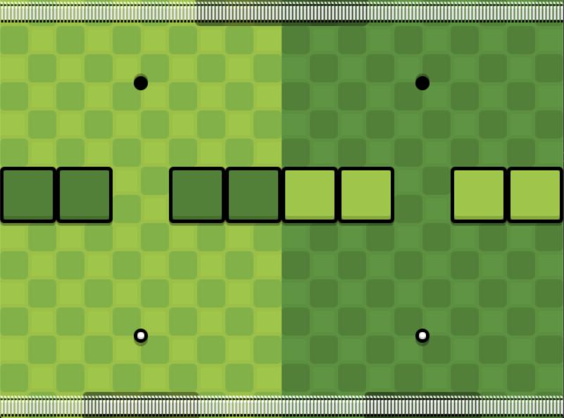
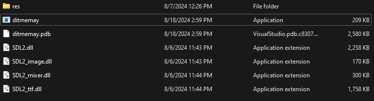
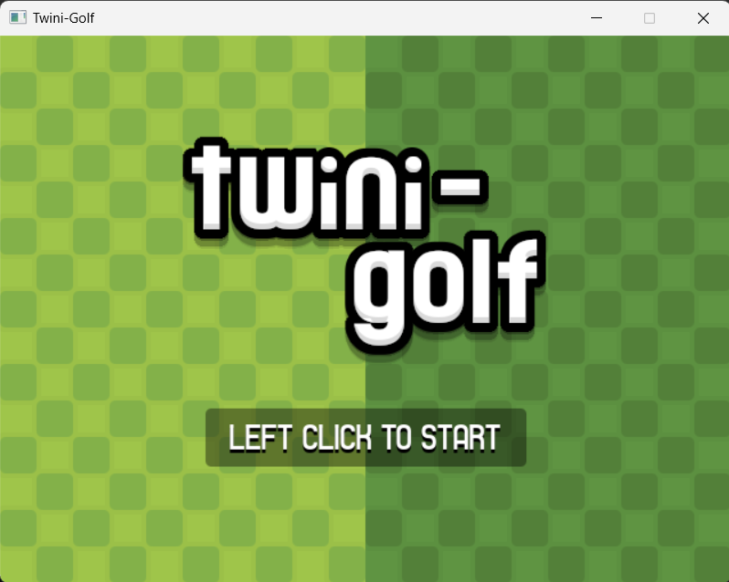
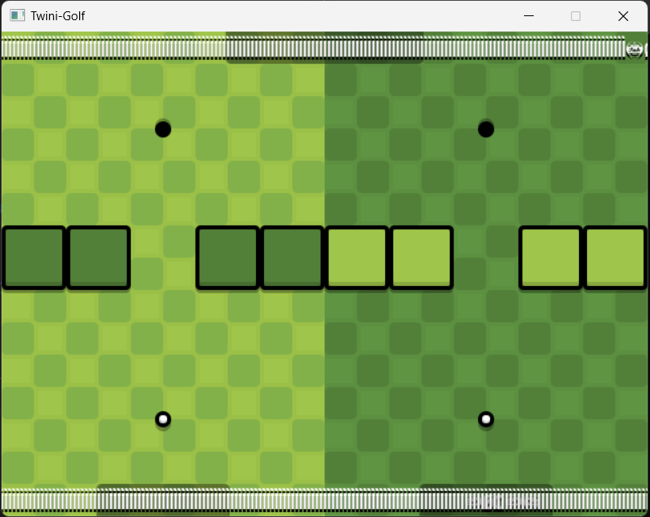
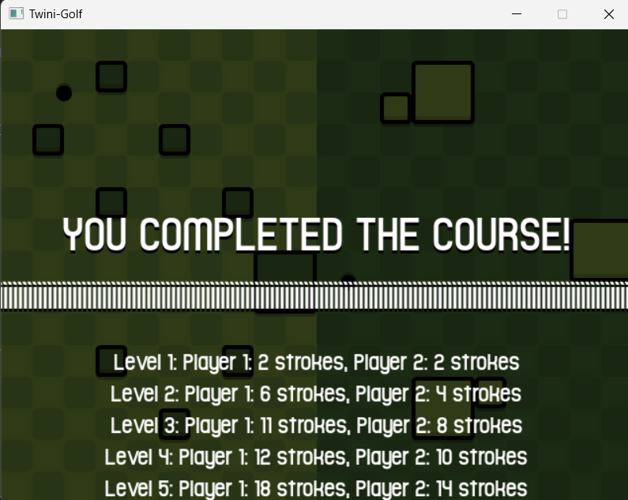

# Twini-Golf

Twini-Golf is a game created for two players to par different holes 

Thử nghiệm game:

#Giới thiệu game
Với mục tiêu để tạo ra một con game mang thiên hướng mini golf nhưng tăng độ khó khi phải điều khiển một lúc hai bóng với hai stage có chướng ngại vật khác nhau. Ban đầu game có ý định cho một người chơi nhưng khi cải tiến game sẽ dành cho hai người chơi và đếm số gậy mỗi level hoặc tổng số gậy để phân thắng bại.

# Windows
Sau khi cài đặt môi trường Mingw64, SDL2, SDL_Image, SDL_TTF, and SDL_Mixer.

File .exe sẽ ở trong mục ./bin. Để game chạy cần copy ./res folder và các .dll files từ trong thư viện SDL.

# Bắt đầu game

Màn hình khởi động game có thể bấm bất cứ vị trí nào trên màn hình để khởi động

Người chơi sẽ luân phiền nhau đưa các bóng của mình vào lỗ và đồng thời hai bóng sẽ di chuyển nên chiến thuật sẽ là để bóng mình vào lỗ nhanh nhất nhưng cũng làm chậm quá trình đưa bóng vào lỗ của đối phương 

Xong khi hai bóng đều vào lỗ trò chơi sẽ tự động đổi sang level khác và chướng ngại vật cũng sẽ thay đổi

Khi kết thúc màn hình sẽ hiện lên số gậy mỗi người chơi sử dụng trong mỗi màn có thể so tổng số gậy hoặc tổng số màn thắng 

# Game resource
Game texture:
 

Các chướng ngại vật của game

Background của game

 quả bóng 
 công cụ điều hướng bóng 

# Source code:

Classes: 
File renderwindow này quản lý việc tạo cửa sổ, tải và hiển thị texture, vẽ các thực thể và văn bản lên màn hình trong game "Twini Golf" bằng SDL2.
File Entity: Định nghĩa một thực thể trong game với các thuộc tính như vị trí, góc xoay, tỷ lệ, và texture, đồng thời cung cấp các phương thức để thao tác và cập nhật những thuộc tính này.

File Tile: Định nghĩa một ô gạch (tile) trong game, kế thừa từ Entity, sử dụng để xây dựng các thành phần bản đồ hoặc môi trường

File Ball quản lý việc di chuyển, va chạm, và trạng thái của quả bóng trong game "Twini Golf", đồng thời điều khiển hiệu ứng âm thanh và kiểm tra điều kiện thắng khi bóng vào hố.

File Hole định nghĩa một hố golf trong game "Twini Golf", kế thừa từ Entity, để quản lý vị trí và texture của hố.

Nhiệm vụ của file main: 
File main.cpp là file chính của game "Twini-Golf". Nhiệm vụ chính của file này là khởi tạo và quản lý vòng đời của game, bao gồm:

Khởi tạo và tải tài nguyên:

    Khởi tạo SDL và các thư viện phụ trợ như SDL_image, SDL_ttf, SDL_mixer.
    Tải các tài nguyên cần thiết như texture, âm thanh, và font chữ.
    Quản lý trạng thái game:

    state điều khiển các trạng thái khác nhau của game như màn hình tiêu đề, chơi game, và màn hình kết thúc.
    Hàm game() kiểm soát luồng xử lý dựa trên trạng thái hiện tại.
    Xử lý các sự kiện và cập nhật game:

    Hàm update() cập nhật trạng thái của game dựa trên thời gian thực và các sự kiện từ người chơi như nhấn chuột.
    Các đối tượng như Ball và Hole được cập nhật vị trí, tốc độ, và xử lý va chạm.
    Render đồ họa:

    Hàm graphics() đảm nhiệm việc vẽ toàn bộ các đối tượng trong game lên màn hình, từ các hố golf, bóng, gạch lát nền, đến giao diện người dùng.
    Chạy vòng lặp game:

    Vòng lặp chính trong main() chạy liên tục cho đến khi người chơi thoát game, đảm bảo cập nhật và vẽ lại màn hình trong mỗi khung hình.
    Dọn dẹp tài nguyên:

    Khi game kết thúc, các tài nguyên được dọn dẹp và bộ nhớ được giải phóng.

Reference:
    Code:https://github.com/PolyMarsDev/Twini-Golf/tree/main
    
    Graphic: PolymarsDev
    
    Font:CstBerlinWest Original Regular : Download For Free, View Sample 
    
    Text, Rating And More On Fontsgeek.Com 
    
    Sound: https://freesound.org/
# Video: 

https://drive.google.com/drive/folders/16sfPJupcYrJRb6lWeTiGXLGkU-J0JUut?usp=drive_link